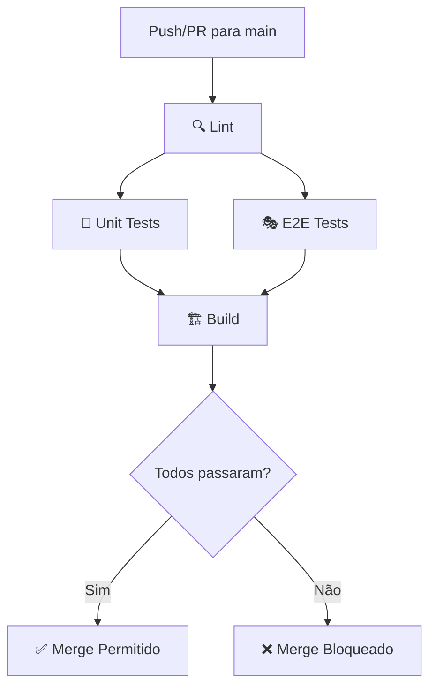

# 🚀 GitHub Actions CI/CD Pipeline - Guia Completo

## 📋 Resumo da Implementação

Pipeline de Integração Contínua configurada com **4 jobs principais**:

1. **🔍 Lint** - Verificação de código (TypeScript + Prettier)
2. **🧪 Unit Tests** - Testes Jest (unitários + integração)
3. **🎭 E2E Tests** - Testes Playwright (end-to-end)
4. **🏗️ Build** - Compilação TypeScript

---

## ⚙️ Configuração do GitHub Actions

### Arquivo Criado

```
.github/
└── workflows/
    └── ci.yml          # Pipeline principal
```

### Triggers Configurados

```yaml
on:
  push:
    branches: [main] # Executa em todo push para main
  pull_request:
    branches: [main] # Executa em todo PR para main
```

---

## 🔧 Scripts Adicionados ao package.json

```json
{
  "scripts": {
    "lint": "eslint . --ext .ts,.js --max-warnings=0",
    "lint:fix": "eslint . --ext .ts,.js --fix",
    "format": "prettier --write \"**/*.{ts,js,json,md}\"",
    "format:check": "prettier --check \"**/*.{ts,js,json,md}\"",
    "type-check": "tsc --noEmit",
    "ci": "npm run type-check && npm run format:check && npm test && npm run test:e2e && npm run build"
  }
}
```

### Uso Local

```bash
# Verificar problemas de lint
npm run lint

# Corrigir problemas automaticamente
npm run lint:fix

# Formatar código
npm run format

# Verificar formatação sem modificar
npm run format:check

# Verificar tipos TypeScript
npm run type-check

# Rodar pipeline completa localmente
npm run ci
```

---

## 📦 Dependências Necessárias

Para instalar as ferramentas de lint faltantes:

```bash
npm install --save-dev \
  eslint \
  @typescript-eslint/parser \
  @typescript-eslint/eslint-plugin \
  prettier
```

---

## 🛡️ Como Configurar Branch Protection no GitHub

### Passo 1: Acessar Configurações do Repositório

1. Vá para o repositório: `https://github.com/jeremiasmarinho/techlog-clinic-os`
2. Clique em **Settings** (Configurações)
3. No menu lateral esquerdo, clique em **Branches**

### Passo 2: Adicionar Regra de Proteção

1. Clique em **Add rule** (ou **Add branch protection rule**)
2. Em **Branch name pattern**, digite: `main`

### Passo 3: Configurar Proteções Obrigatórias

Marque as seguintes opções:

#### ✅ Require a pull request before merging

- Exige que todo código passe por Pull Request antes de ir para main
- **Opções recomendadas:**
  - ✅ Require approvals (pelo menos 1 aprovação)
  - ✅ Dismiss stale pull request approvals when new commits are pushed

#### ✅ Require status checks to pass before merging

**ESTA É A MAIS IMPORTANTE!**

- Ativa verificação de CI antes de permitir merge
- Clique em **Add** e adicione os seguintes checks:
  - `🔍 Lint & Code Quality`
  - `🧪 Unit & Integration Tests`
  - `🎭 E2E Tests (Playwright)`
  - `🏗️ Build Production`
  - `✅ CI Success`

**Opções adicionais:**

- ✅ **Require branches to be up to date before merging** (Recomendado)
  - Garante que o PR está sincronizado com main antes do merge

#### ✅ Require conversation resolution before merging

- Força que todos os comentários sejam resolvidos antes do merge

#### ✅ Do not allow bypassing the above settings

- Nem administradores podem ignorar essas regras (Recomendado para produção)

### Passo 4: Salvar

Clique em **Create** (ou **Save changes**)

---

## 🚨 Como Funciona a Proteção

### ✅ Cenário de Sucesso

```
1. Developer cria branch: feature/nova-funcionalidade
2. Faz commits e push
3. Abre Pull Request para main
4. GitHub Actions executa CI automaticamente:
   ✅ Lint passou
   ✅ Unit tests passou (60 tests)
   ✅ E2E tests passou (6 tests)
   ✅ Build passou
5. Botão "Merge" fica VERDE e habilitado
6. Merge permitido! 🎉
```

### ❌ Cenário de Falha

```
1. Developer cria branch: feature/codigo-quebrado
2. Faz commits e push
3. Abre Pull Request para main
4. GitHub Actions executa CI:
   ✅ Lint passou
   ❌ Unit tests falhou (3 testes falharam)
   ⏭️  E2E tests pulado (depende de unit)
   ⏭️  Build pulado
5. Botão "Merge" fica VERMELHO e DESABILITADO
6. Pull Request BLOQUEADO até corrigir! 🚫
```

---

## 📊 Visualizações e Relatórios

### Coverage Report Automático

Quando um PR é aberto, o workflow automaticamente comenta com o relatório de coverage:

```markdown
## 📊 Coverage Report

| Metric        | Percentage | Covered / Total |
| ------------- | ---------- | --------------- |
| 🎯 Statements | 85.3%      | 1024 / 1200     |
| 🌿 Branches   | 72.1%      | 456 / 632       |
| ⚡ Functions  | 88.9%      | 240 / 270       |
| 📝 Lines      | 86.2%      | 1015 / 1178     |
```

### Artefatos Salvos (30 dias)

Se os testes falharem, você pode baixar:

- 📸 Screenshots do Playwright
- 🎬 Vídeos dos testes E2E
- 📊 Relatório HTML do coverage
- 📄 Logs completos

---

## 🔄 Workflow de Desenvolvimento Recomendado

### 1. Criar Nova Feature

```bash
# Criar branch a partir de main
git checkout main
git pull origin main
git checkout -b feature/minha-funcionalidade

# Desenvolver...
# Fazer commits...
```

### 2. Antes de Fazer Push

```bash
# Rodar pipeline localmente (simula CI)
npm run ci

# Se tudo passar:
git push origin feature/minha-funcionalidade
```

### 3. Abrir Pull Request

1. Vá no GitHub e clique em **Compare & pull request**
2. Descreva as mudanças
3. Aguarde CI rodar automaticamente
4. Se falhar, corrija e faça novo push (CI roda de novo)
5. Se passar, solicite review

### 4. Merge

- ✅ CI passou
- ✅ Review aprovado
- ✅ Conversas resolvidas
- **Botão de merge habilitado!**

---

## 🎯 Fluxo Completo da Pipeline



---

## ⚡ Otimizações Implementadas

### 1. Cache de Dependências

```yaml
- uses: actions/setup-node@v4
  with:
    cache: 'npm' # Cache automático de node_modules
```

**Benefício:** Reduz tempo de install de ~2min para ~20s

### 2. Jobs Paralelos

- Lint, Unit Tests e E2E Tests rodam **simultaneamente**
- Build só roda se todos passarem
- **Benefício:** Pipeline completa em ~3-5 minutos

### 3. Concurrency

```yaml
concurrency:
  group: ${{ github.workflow }}-${{ github.ref }}
  cancel-in-progress: true
```

**Benefício:** Se você fizer novo push, cancela workflow anterior (economiza minutos de Actions)

---

## 📝 Checklist de Configuração

### No Repositório Local

- [x] ✅ Criar `.github/workflows/ci.yml`
- [x] ✅ Criar `.eslintrc.js`
- [x] ✅ Criar `.prettierrc.json`
- [x] ✅ Criar `.prettierignore`
- [x] ✅ Adicionar scripts de lint no `package.json`
- [ ] ⚠️ Instalar dependências de lint:
  ```bash
  npm install --save-dev eslint @typescript-eslint/parser @typescript-eslint/eslint-plugin prettier
  ```
- [ ] ⚠️ Fazer commit e push:
  ```bash
  git add .
  git commit -m "ci: Add GitHub Actions CI/CD pipeline"
  git push origin main
  ```

### No GitHub (Website)

- [ ] ⚠️ Configurar Branch Protection para `main`
- [ ] ⚠️ Adicionar status checks obrigatórios
- [ ] ⚠️ Testar criando um Pull Request

---

## 🧪 Testando a Pipeline

### Teste 1: Pull Request com Sucesso

```bash
# Criar branch de teste
git checkout -b test/ci-success

# Fazer pequena mudança
echo "// Test CI" >> src/server.ts

# Commit e push
git add .
git commit -m "test: CI pipeline"
git push origin test/ci-success

# Abrir PR no GitHub
# ✅ Verificar se CI passa
```

### Teste 2: Pull Request com Falha

```bash
# Criar branch de teste
git checkout -b test/ci-failure

# Introduzir erro intencional
echo "const x: number = 'string';" >> src/server.ts

# Commit e push
git add .
git commit -m "test: CI failure"
git push origin test/ci-failure

# Abrir PR no GitHub
# ❌ Verificar se CI falha e bloqueia merge
```

---

## 🔍 Monitoramento e Logs

### Ver Status da Pipeline

1. Vá para o repositório no GitHub
2. Clique na aba **Actions**
3. Veja todos os workflows executados

### Detalhes de um Workflow

1. Clique no workflow específico
2. Veja cada job individualmente
3. Expanda steps para ver logs detalhados

### Badges (Opcional)

Adicione ao `README.md`:

```markdown

```

Resultado:


---

## 🆘 Troubleshooting

### Problema: "Status checks are required but not enabled"

**Solução:**

1. Faça pelo menos 1 push para main com o workflow
2. Aguarde o workflow rodar uma vez
3. Então configure Branch Protection
4. Os checks aparecerão na lista

### Problema: "npm ci failed"

**Solução:**

- Certifique-se que `package-lock.json` está commitado
- Se usar `npm install`, delete `package-lock.json` e gere novo com `npm install`

### Problema: "Playwright browsers not found"

**Solução:** Já resolvido no workflow com:

```yaml
- run: npx playwright install --with-deps chromium
```

### Problema: "TypeScript compilation failed"

**Solução:**

```bash
# Rodar localmente primeiro
npm run type-check

# Corrigir erros de tipo
# Então fazer push
```

---

## 📚 Recursos Adicionais

- **GitHub Actions Docs:** https://docs.github.com/en/actions
- **Branch Protection:**
  https://docs.github.com/en/repositories/configuring-branches-and-merges-in-your-repository/managing-protected-branches
- **ESLint Config:** https://eslint.org/docs/latest/user-guide/configuring/
- **Prettier Config:** https://prettier.io/docs/en/configuration.html

---

## 🎉 Benefícios da Pipeline CI/CD

✅ **Qualidade:** Código ruim não entra em produção  
✅ **Confiança:** Testes rodam automaticamente sempre  
✅ **Velocidade:** Feedback imediato em cada commit  
✅ **Documentação:** Histórico de todos os testes no GitHub  
✅ **Colaboração:** Reviews mais focados (CI já validou o básico)  
✅ **Profissionalismo:** Padrão da indústria implementado

---

**Última atualização:** February 1, 2026  
**Status:** ✅ Completo e Pronto para Uso  
**Versão:** 1.0
